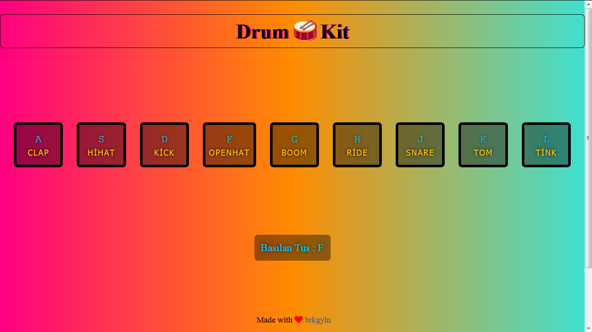

# -Day1- Drum Kit :drum: with Javascript

# -Learned 

   - addEventListener can listen to a ton of events
   - For every key pressed, there’s a ton of information being passed to the function
   - Data attributes are a great way to add extra information
   - Playing audio files is as simple as running .play()
   - querySelector can be used to select a matched element
   -classList returns a list of all classes which can be modified
   
# -Preview

