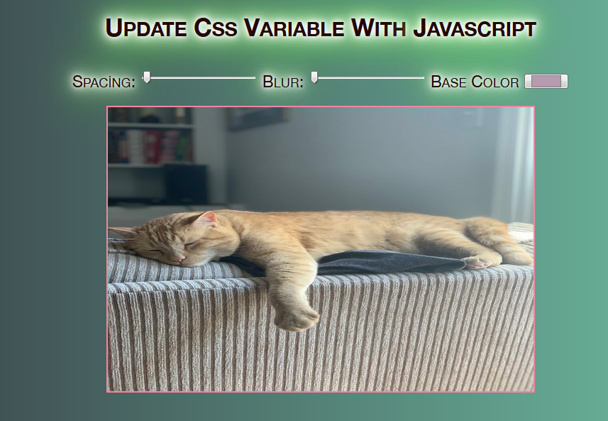

# Day3 - Update Css Variable With Javascript
 - Using pseudo-class :root we can declare global CSS variables which can be updated with JavaScript.

 - There are set using custom property notation (e.g. --main-color: green;). We can access to them by the var() function (e.g. color: var(--main-color);).
 
## - Learned 

- CSS Variables can be updated with JavaScript:

    document.documentElement.style.setProperty(`--${this.name}`, value + suffix);

    This is unlike SASS variables which are defined at compile time and cannot be updated
    Dataset is an object that contains all of the data attributes set on HTML elements
    The dataset can be console logged to see it’s attributes, names, methods, etc
   
## - Preview

## Live Demo

 [Click Here](https://brkgyln-day3-updatecsswithjs.netlify.app/)
